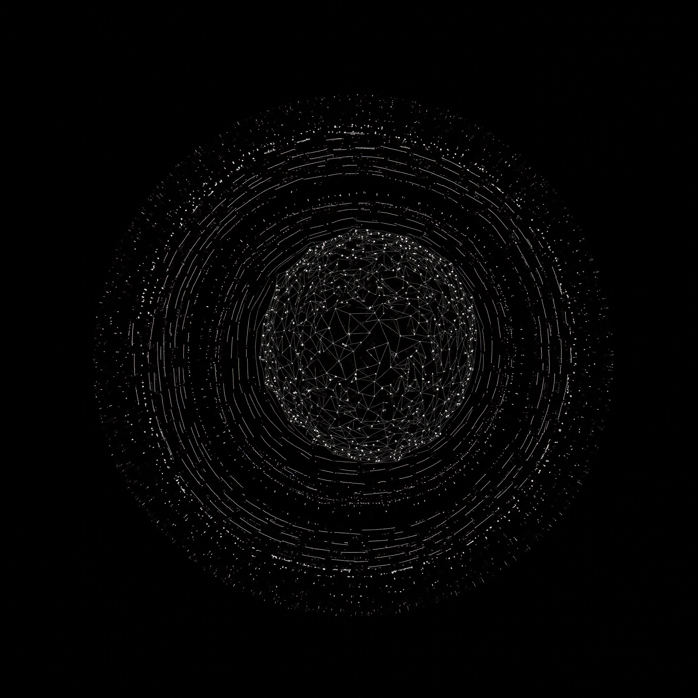

# Natural Simulation Hypothesis (NSH)

### Summary
Most simulation arguments assume that advanced civilizations intentionally create artificial worlds. **The Natural Simulation Hypothesis (NSH)** flips this premise: simulations can arise naturally, without intent. When emergence alone can generate complex observer-like behavior, no simulator is required.

### Core Argument

1.  **Emergence is real.** 
- Complex, self-organizing behavior arises in nature from simple rules (e.g., Conway's Game of Life, fractal growth, weather patterns, evolutionary dynamics).  
2.  **Natural simulations exist.**
- Many physical systems unintentionally simulate lifelike, computational, or conscious-seeming behavior. These include chemical substrates, neural systems, and self-replicating automata.  
3.  **Intentional simulations are rare.**
- Few civilizations reach simulation capability. Of those, few run ancestor-style simulations at scale.  
4.  **Natural simulations are common.**
- Nature produces countless self-organizing systems capable of simulation-like complexity across scale. These simulations emerge without design—only boundary conditions and recursion.  
      
**Therefore:** *If we are in a simulation, it is overwhelmingly more likely to be a naturally occurring emergent system rather than a deliberately constructed one.*

### Comparison to Other Simulation Arguments

| Feature / Claim                      | Bostrom (2003) | Digital Physics | Tegmark MUH | Holofractal Cosmology | Natural Simulation Hypothesis (NSH) |
|-------------------------------------|----------------|------------------|-------------|------------------------|-------------------------------------|
| Requires advanced civilization      | Yes            | No               | No          | No                     | No                                  |
| Assumes intent                      | Yes            | No               | No          | No                     | No                                  |
| Simulation as computation           | Yes            | Yes              | No          | Sometimes              | Not necessarily                     |
| Compatible with physical emergence  | No             | Partially        | No          | Yes                    | Yes                                 |
| Observer emergence required         | Yes            | Sometimes        | No          | Yes                    | Yes                                 |
| Rooted in probabilistic argument    | Yes            | No               | No          | No                     | Yes                                 |
| Considers recursion / scale         | No             | Sometimes        | No          | Yes                    | Yes                                 |
| Philosophically ontological         | Somewhat       | Yes              | Yes         | Somewhat               | No                                  |
| Falsifiable or testable implications| Low            | Low              | Very Low    | Medium                 | Medium to High                      |

-   **Bostrom's Simulation Argument (2003)**  
	-   Claims one of three must be true: civilizations go extinct, they don’t simulate, or we’re in a simulation.  
      -   NSH agrees we may be in a simulation, but posits that such simulations arise without intent—as a natural consequence of emergence.  
 
 -   **Digital Physics (Fredkin, Wolfram)**
	 -    Suggests the universe is discrete and computational. 
		 -    NSH is compatible but broader: not all computation is digital or deliberate.  

-   **Tegmark’s Mathematical Universe Hypothesis**  
	- Asserts all consistent mathematical structures exist. 
	- NSH focuses on emergent simulation dynamics, not platonic ontology.  
      
-   **Holofractal Cosmology:**     
	-   Posits recursive, scale-invariant geometry in spacetime.  
	-   NSH aligns conceptually but grounds itself in probabilistic emergence, not geometry alone.  

### Reframing

This reframes the simulation debate: not as a question of "who built us," but what kind of emergence we’re embedded in. The universe itself may be recursively simulating patterns—including us—without ever having been "designed."

### Implication

> Intent requires emergence. Emergence does not require intent.

The NSH places simulation within the laws of physics and recursion—not futuristic computers or external creators.

<h2>Connected Concepts</h2>
<ul>
<li>Entropia</li>
<li>Scale Organization Theory</li>
<li>Hologenesis</li>
</ul>
